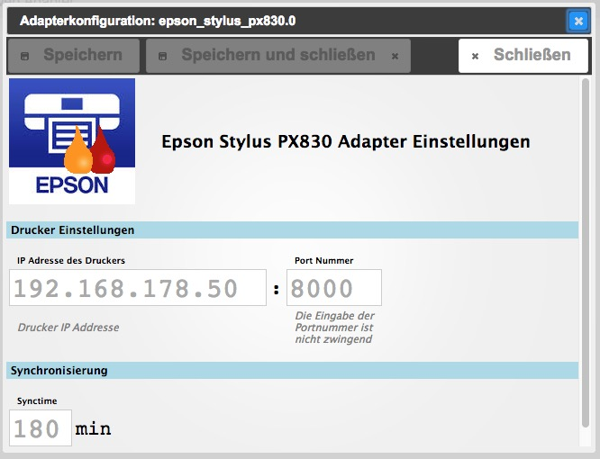

# ioBroker.epson_stylus_px830
=================

## Beschreibung / Description
:de: Dieser Adapter liest den Zustand der Tintenpatronen eines Epson Stylus Photo PX830 von des Webseite ein

:uk: This adapter reads the ink levels of an Epson Stylus Photo PX830 from the printers website

## Einstellungen / Configuration
### IP / Port
Die IP Adresse des Druckers im lokalen Netzwerk. Ohne Eingabe gibt es keine Abfrage. Die Portnummer ist optional und wird nur bei Eingabe einer IP-Adresse berücksichtigt.

IP adress of Epson Printer within local network. The adapter will stop if no IP is entered. The port number is optional and only will be considered if an ip adress was set before.

### Synchronisation
Dauer zwischen den Abfragen des Druckers durch ioBroker. Die Eingabe ist optional. Standard ist 180 Minuten (alle 3 Stunden).

In synctime you can choose the frequency of connections to the printer in minutes. Default is 180min, input is optional.

##  Datenpunkte / Datapoints

## Aktivierung / Schedule
Der Adapter startet wie in den Einstellungen angegeben.

The adapter starts as often as set up in the settings window.

##  Datenpunkte / Datapoints

epson_stylus_px830.0.__UNREACH__ (*boolean*)

epson_stylus_px830.0.__IP__(*string*)

epson_stylus_px830.0.__connect__ (*string*)

epson_stylus_px830.0.__name__  (*string*)

epson_stylus_px830.0.__model__ (*string*)

epson_stylus_px830.0.__mac__ (*string*)

epson_stylus_px830.0.__inks__ (*channel*)

For every color:

epson_stylus_px830.0.__inks.color.level__ (*number 0-100%*)

epson_stylus_px830.0.__inks.color.cartridge__ (*string*) -> Epson product name for its ink

## Changelog
### 0.0.1 (2016-06-22)
* (pix) first release

## License

The MIT License (MIT)

Copyright (c) 2016 pix

Permission is hereby granted, free of charge, to any person obtaining a copy
of this software and associated documentation files (the "Software"), to deal
in the Software without restriction, including without limitation the rights
to use, copy, modify, merge, publish, distribute, sublicense, and/or sell
copies of the Software, and to permit persons to whom the Software is
furnished to do so, subject to the following conditions:

The above copyright notice and this permission notice shall be included in all
copies or substantial portions of the Software.

THE SOFTWARE IS PROVIDED "AS IS", WITHOUT WARRANTY OF ANY KIND, EXPRESS OR
IMPLIED, INCLUDING BUT NOT LIMITED TO THE WARRANTIES OF MERCHANTABILITY,
FITNESS FOR A PARTICULAR PURPOSE AND NONINFRINGEMENT. IN NO EVENT SHALL THE
AUTHORS OR COPYRIGHT HOLDERS BE LIABLE FOR ANY CLAIM, DAMAGES OR OTHER
LIABILITY, WHETHER IN AN ACTION OF CONTRACT, TORT OR OTHERWISE, ARISING FROM,
OUT OF OR IN CONNECTION WITH THE SOFTWARE OR THE USE OR OTHER DEALINGS IN THE
SOFTWARE.

---
*Dank an die Erfinder des Basisskripts zum Parsen der Daten, Idittmar und MistyReblaus aus dem [Homematic-Forum](http://homematic-forum.de/forum/viewtopic.php?f=31&t=25140).* :+1: 